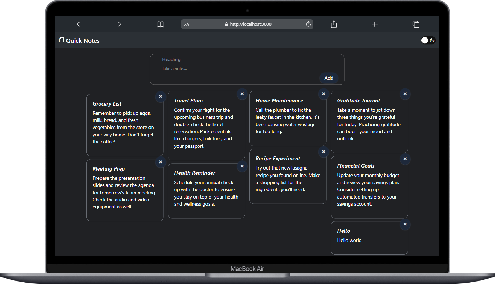

Quick Notes is a notes taking Application that can be used to store short notes and all.
It is a Clone of Google Keep Notes

Technologies Used
-----------------
Front End Technologies:
  HTML,
  CSS,
  EJS,
  JavaScript
  
Back End Technologies:
  Node.JS

Database:
  Mongo DB
